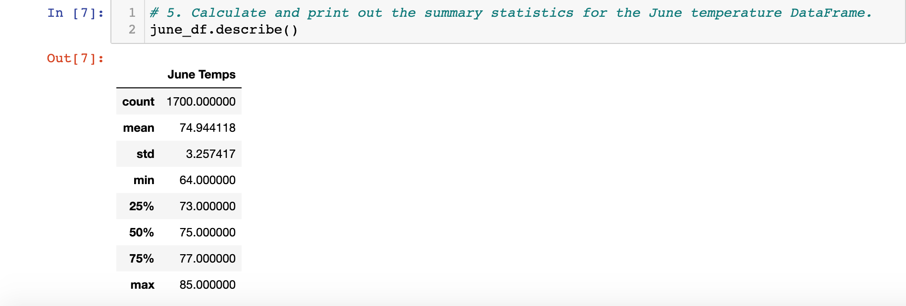
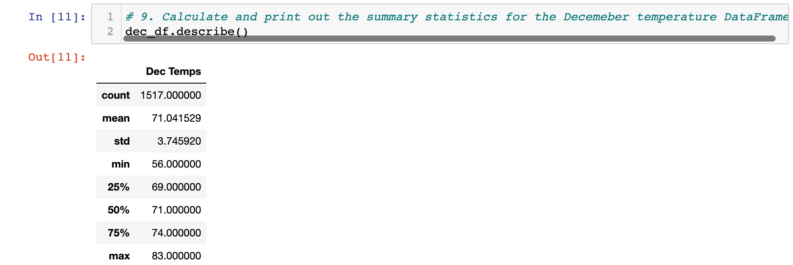
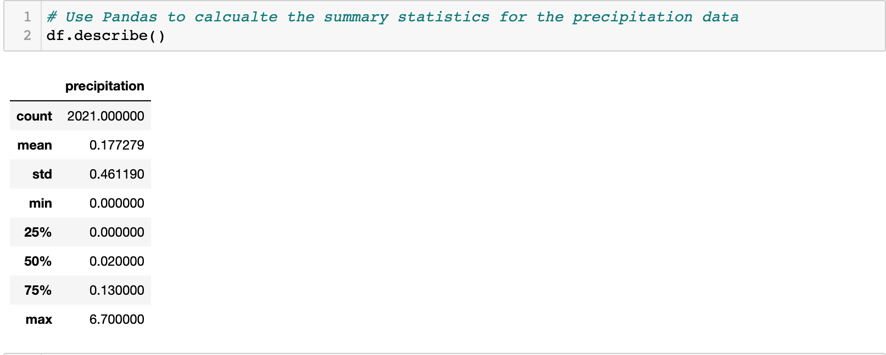

# Surfs_Up

## Overview
The purpose of this analysis was to find out more information about temperature data for the months of June and December. This information is needed to determine if the surf and ice cream shop business is sustainable year-round.

## Results
### Takeaways from Deliverable 1
- So for Deliverable 1 I was tasked in getting the summary statistics for the month of June in Oahu. When I ran the code and got the output below, the first thing i noticed was that the temperature was not as hot as I thought it would be. Since Oahu is located in the state of Hawaii, and since Hawaii is much closer to the equator (resulting in much warmer temperatures), the max temperature was exactly 85 degrees. I was expecting the max temperature to be much hotter since Hawaii is much closer to the equator than the rest of the United States. 

- In addition when executing the code, the overall stats for the temperatures of June were relatively close to each other. This can be seen in the lower to upper quartiles where the temperatures were all in the 70s and the average temperature for the month of June was around 75 degrees. This means that the majority of the temperatures will be around the 70s and this is only the beginning of the summer months to come. I believe if we ran the July or August temperatures as well, the temperatures will be much hotter which would cause the surf and ice cream shop to thrive.

#### Summary Statistics for June

### Takeaway from Deliverable 2
- For Deliverable 1 we checked if the shop would be sustainable in the summer months but for Deliverable 2, I was also asked in getting the temperature statistics for the winter month of December. When retrieving the data, one thing that was predictable was that the temperature would be lower than in the summer. But something I did not expect was the fact that despite the temperatures being lower, it was not a drastic change. For example, even in the the largest gap in the data between temperatures is in the minimum temperature (which is 64 degrees in June and 56 degrees in December). For the most part, due to Oahu's location, the temperatures remain the same unlike most states in the Unites States. 

#### Summary Statistics for December

## Summary
- Based on the results from Deliverables  one and two, I do think that the surf and ice cream shop will be sustainable year round. For the ice cream shop, the temperatures for both June and December I think are still warm enough to provide business. Despite the constant warmer weather, I do think that the best time for business will be in the summer months simply because of the high temperatures that come in the summer. I do think there will also be business in the winter but I do expect there to be somewhat of a slow down due to the temperature decreasing. I also believe the surf shop itself will be profitable year round mainly because surfing is one of the states main pastimes in which the surf shop can tae advantage of. I can see the sop doing its best when the temperature is both hot enough for ice cream as well as it being high tide for local surfers.

### Weather Data
- If I was requested to make an additional query, I would look up the data to check the amount of times the weather was clear and sunny for the months of June and December. The reason I would make this extra query is because I do believe the weather itself can play a role in drumming up some buisness. If the weather is clear skies and sunny, then it is possible that customers can come to the shop for either surfing or ice cream.

### Precipitation Data
- In addition to looking at the temperature data, I also think it is important to look at the amount of precipitation that occurs in Oahu to predict the amount of business that the shop will have that day. This precipitation data goes for the entire year of 2016-2017 so we cannot see the specific data for June and December at a glance (we would have to do a bit of digging to look at all the days for both months). I think looking at the precipitation data is important is because I do believe that the weather can sway people on whether or not. Just like with the weather data for sunny weather, I think rainy weather can deter some of the locals or other people from going to the shop to either surf or get ice cream. While it may not be entirely accurate at times, I do think getting the precipitation data for the winter and summer months can be a kind of prediction to see how much business will be that day.

#### Precipitation Data

## Resources
-Anaconda version 2.1.1

-Jupyter Notebook version 6.4.5

-Python version 3.9.7

-Pandas version 1.3.4
